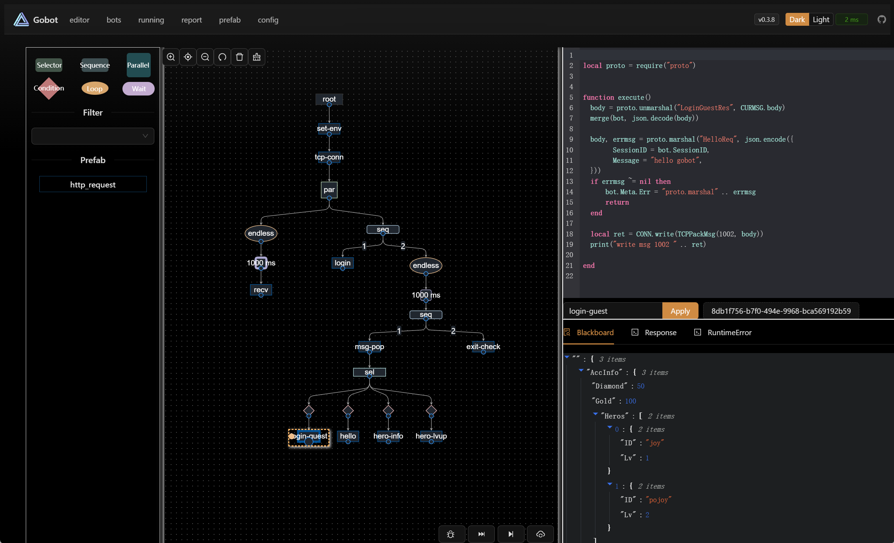

# Gobot v0.4.4

> Gobot is a powerful stateful API testing robot. It provides a graphical interface for building test scenarios, allows for easy test script writing, step-by-step debugging and pressure testing, and can share and store states between each stage of the testing process.

## The core goals of GoBot are:
1. Universality: Support for any type of game and mainstream protocols (HTTP, TCP, WebSocket, with ongoing additions).
2. Reusability: Test scenarios are maintainable, and test scripts (Cases) can be reused through Prefab.
3. Ease of use: Provide a robot editor and support breakpoint debugging.

## Website Pages
- [Introduction](introduction.md)
- [Install](install.md)
- Pages
    - [Editor](pages-editor.md)
    - [Bots](pages-bots.md)
    - [Running](pages-running.md)
    - [Report](pages-report.md)
    - [Prefab](pages-prefab.md)
    - [Config](pages-config.md)
- [OpenApi](openapi.md)
- Script Modules
    - [Global](script-global.md)
    - [Http](script-http.md)
    - [Tcp](script-tcp.md)
    - [Websocket](script-websocket.md)
    - [Protobuf](script-protobuf.md)
    - [MongoDB](script-mongodb.md)
    - [Base64](script-base64.md)
    - [Utils](script-utils.md)
- [Q&A](qa.md)

---

## Citations:
- UI library https://github.com/ant-design/ant-design
- Graph Editing Engine https://github.com/antvis/X6
- Go lua https://github.com/yuin/gopher-lua
- Docs template https://github.com/hibbitts-design/docsify-this-multilanguage-site
