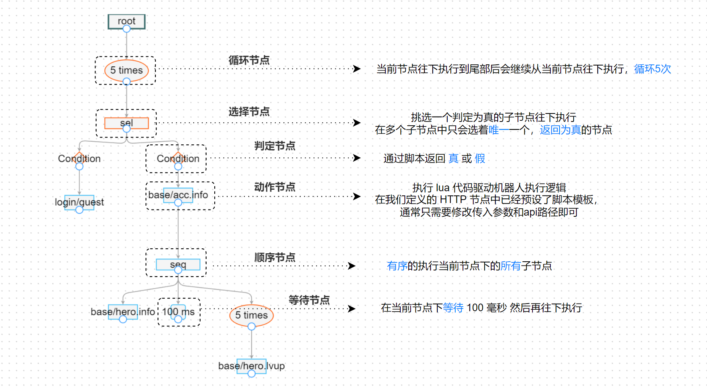

# 行为树
> 略

### 行为树节点
> 在 gobot 中目前支持以下这些节点

|控制节点|条件节点|装饰节点|行为节点|
|-|-|-|-|
|Selector 选择节点|Condition 判定节点|Loop 循环节点|HTTP 脚本节点|
|Sequence 顺序节点|Assert 断言节点|Wait 等待节点||
|Parallel 并行节点 （暂未实现||||

### 案例图示

> 我们可以在 [样例网站](http://1.117.168.37:7777/) 中尝试体验这个行为树的执行过程
1. 打开网站进入 Home(主页
2. 点击选择 api_test_http.xml , 点击上方的 Load (载入 按钮
3. 点击右下方的 Create（创建 按钮
4. 点击 Step (单步执行 按钮

> 注: 我们也可以点选任意一个节点，查看节点的可编辑数据（脚本) 是如何配置的

---

### 案例描述
- (1) 链接`循环节点`并设置为`5次`，表示这颗树会循环执行5遍
- (2) 因为我们需要逻辑上走`不同的分支`，所以这里链接个`选择节点`
- (3) 判定节点
    - (3.1) 这个判定分支在代码中`判定了 Token ==等于 空`的逻辑，表示当`这是一个新账号的时候`走这个分支
        - (3.1.1) 当没有账号的时候，我们链接了一个 `HTTP 节点`，用于实现`游客登陆的逻辑`，并将新账号的 Token 赋予 meta.Token 字段，在后续的逻辑中，我们`只需调用 meta.Token 即可获取这个值`
    - (3.2) 这个判定分支在代码中`判定了 Token ~=不等于 空`的逻辑，表示当这是一个`老账号`的时候走的分支
        - (3.2.1) 当拥有账号的时候，我们实现了一个`获取账号信息`的 `HTTP 节点`
        - (3.2.2) 当我们获取到账户信息后，我们`需要执行一系列的动作`，因此我们链接了一个`顺序节点`，用于执行一系列的动作
            - (3.2.2.1) 获取账号的英雄信息
            - (3.2.2.2) 等待 100 毫秒
            - (3.2.2.3) 链接一个循环节点，将挂靠在`本节点下面的动作执行5次`
                - (3.2.2.3.1) 执行账号英雄升级的请求

> 通过上面的案例，我们使用机器人先登录了账号，然后执行了4遍，升级英雄账号5次的行为； 通过 Step 我们可以看到每一个节点上机器人数据的变化过程