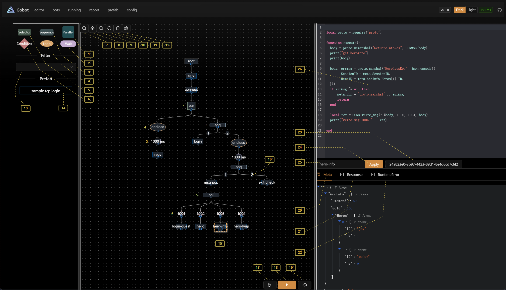

# 编辑&调试页

> 编辑行为树的视窗

### 行为树节点（1 - 6）
1. Parallel - 并行节点
2. Wait - 等待节点（毫秒
3. Sequence - 队列节点
4. Loop - 循环节点
5. Selector - 选择节点
6. Condition - 判定节点 

> 更详细的行为树参考

### 编辑器视窗功能项（7 - 12）
7. ZoomIn - 放大视图
8. Reset - 重置视图大小
9. ZoomOut - 缩小视图
10. Undo - 撤销一步行为树的操作 （快捷键 control + z
11. Delete - 删除一个节点 （快捷键 del
12. Clean - 清除当前视图内的行为树

### 预制节点区域（13 - 14）
13. Filter - 过滤器，通过字符过滤相关的 prefab 节点
14. Prefab node - 预制节点，在[prefab]()中预先编写的通用节点，可以拖拽到视图直接使用

### 行为树调试提示相关（15 - 19）
15. 黄色虚线框选 - 表示节点处于选中状态
16. 2 表示这个节点是 sequence 的第二个节点（有时候来回拖拽节点会打乱正真的执行顺序
17. Debug - 开始进行调试（创建一个当前视图的机器人作为调试机器人
18. Step - 单步执行
19. Upload - 将当前视图的机器人上传到 bots 中进行管理

### 调试信息相关（20 - 22）
20. Meta - 机器人元信息面板（包含所有机器人的属性，作用域是机器人自身
21. Response - 当机器人执行到节点后，节点的返回值信息会在这里显示（如果有并行会有多条信息
22. Runtime Error - 运行到节点是遇到的错误信息

### 节点信息相关（23 - 26）
23. 展示节点的唯一 ID
24. 当节点的脚本或参数被修改时，需要点击 apply 应用
25. 节点的名称（会显示到视图中
26. 节点的脚本编辑窗口