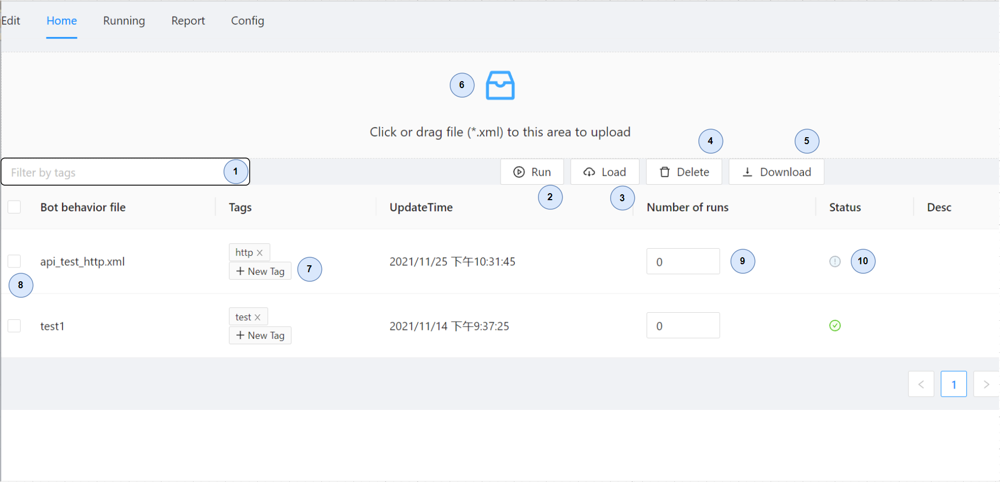

# Home (行为树文件管理页
> Bot（行为树）管理

1. 过滤器 ------- 通过`tag`的过滤`筛选`出想要的bot列表
2. Run ---------- 运行`选中`的bot
3. Load --------- 将第一个被选中的bot加载到本地，并跳转到edit页
4. Delete ------- 删除`选中`的bot
5. Download --- 下载`选中`bot的行为文件
6. 上传 --------- 拖拽或点击文件到上传区域中，将bot的行为文件上传到后台
7. NewTag ------ 为bot创建一个新的标签
8. Checkboox --- 将bot设置为选中的状态
9. 运行数量 ------ 设置运行该bot的数量
10. Status --------- bot被运行后返回的状态码 `未知`灰色 `失败`红色 `成功`绿色